

# ADCC Channel Grouping using PIC16F18146 Microcontroller

This example demonstrates the usage of *Channel Grouping* feature of the ADCC of the PIC16F18146 microcontroller (MCU). Channel grouping allows multiple, simultaneous input connections to the ADCC. All the analog input signals of the group are wire-OR’d into a single ADCC positive input channel as shown below.

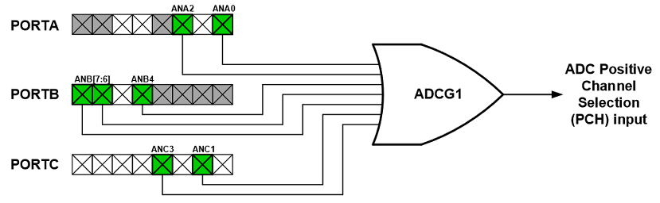

In this example, ADCC combines five Force Sensing Resistors (FSR) to form a single channel. This feature enables to detect changes in the output of FSRs without scanning each FSR individually. Thus it reduces CPU intervention and allows the device to operate in low-power sleep mode most of the time.

Sensor array application such as a smart door mat uses the above principle to operate efficiently. A smart door mat notifies the user when someone steps on the door mat by generating an alarm. With multiple FSRs below the door mat, pressure on the door mat is monitored.

## Related Documentation

- [PIC16F18146 Product Page](https://www.microchip.com/PIC16F18146)
- [PIC16F18146 Data Sheet](https://www.microchip.com/DS40002339)

## Software Used

- MPLAB® X IDE [v6.00 or newer](https://www.microchip.com/mplab/mplab-x-ide)
- XC8 Compiler [v2.35.0 or newer](https://www.microchip.com/mplab/compilers)
- MPLAB® Code Configurator (MCC) [v5.1.2  or newer](https://www.microchip.com/mplab/mplab-code-configurator)
- Microchip PIC16F1xxxx Series Device Support [1.14.187 or newer](https://packs.download.microchip.com/)

## Hardware Used

- [PIC16F18146 DIP IC](https://www.microchip.com/PIC16F18146)
- [Curiosity Development Board](https://www.microchip.com/development-tool/dm164137)
- [FSR 34-00004](https://www.digikey.com/en/products/detail/interlink-electronics/34-00004/2798665?s=N4IgjCBcoLQBxVAYygMwIYBsDOBTANCAPZQDa4ADAEwDsIAugL6OFVkgDMALDBXxVwaMgA)
- 4.7k Ω Resistor
- [Proto Click](https://www.mikroe.com/proto-click)

## Implementation

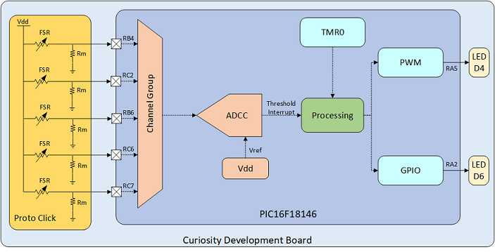

In this example, ADCC operates in “continuous operation mode”. ADCC uses ADCRC clock to operate when MCU is in sleep. ADCC is used single-ended mode thus negative ADCC channel is connected to the ground.

Example uses ADCC‘s Burst Average mode. In this mode, ADCC accumulates a certain number of samples (16 in this case) at a single stretch. It then computes an average of the accumulated value. The use of burst average mode helps to reduce noise thus avoids false detection.

Example also uses ADCC’s Threshold Comparison feature. Using this feature, ADCC generates an interrupt whenever there is a change in the output of any one or more FSRs.

It is possible to apply a maximum of 10N force (which corresponds to 1kg) on the FSR used in this example. All FSRs connect to the MCU’s analog channels using a voltage divider circuit as shown in the block diagram.

Let’s consider movement detection requires a minimum of 100g force on at least one FSR. 100g force corresponds to 5kΩ FSR resistance. Thus, the ADCC channel group observes 1.6V from one FSR. Use the below equation to calculate voltage:

` Vin = (Vdd * Rm)/(Rm+RFSR) -------------------------------------------------(1)`

Where Vdd = 3.3V, Rm= 4.7kΩ

To get the output voltage of the ADCC channel group, average this with the output values of the other four FSRs. If only one FSR is pressed, the grouped input voltage to ADCC will be 0.3V (1.6 / 5). The corresponding ADC count is 396.

`ADC count = (Vin * Max ADC count)/Vref ----------------------------------------(2)`

Where Vref = 3.3V, Max ADC count = 4096

Thus, the upper threshold of ADCC is set as 396 to generate an interrupt and wake up MCU from sleep.

After pressing the FSRs, MCU wakes up due to an upper threshold interrupt. Once woke up, MCU disables the upper threshold interrupt and enables a lower threshold. Then MCU goes to sleep again. A lower threshold limit of 100 is set to generate an interrupt after releasing of the FSRs. Thus, when FSRs are released, MCU wakes up due to a lower threshold interrupt. Once woke up, MCU disables the lower threshold interrupt and enables the upper threshold. This process continues.

When MCU wakes up due to the upper threshold interrupt, it starts blinking LED D4 for five seconds (for demonstration only). 16-bit PWM module is used to blink the LED D4. The MCU does not wait five seconds in active mode to stop the LED D4 blinking. It goes to sleep immediately after starting the LED D4 blinking, as 16-bit PWM operates in sleep mode also. A TMR0 generates an interrupt after five seconds to stop the PWM. Change this period as per application need.

LED D6 indicates FSR’s press and release status. LED D6 stays ON as long as FSRs are being pressed.

## Hardware Setup

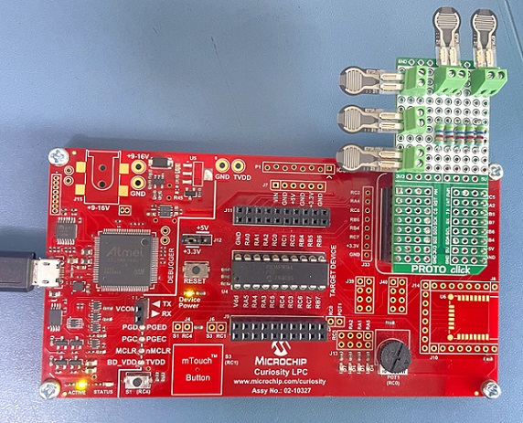

This example uses Curiosity development board as development platform along with PIC16F18146 DIP IC.  Proto click acting as general-purpose PCB is used to connect FSRs to curiosity board. Each FSR connects via voltage divider configuration to the analog channel of MCU.

*Note: FSRs used in this example are for demonstration purpose only. FSRs are available is variety of specifications. Use suitable FSRs in real-world application (such as door mat).*

## Pin Connection Table

| Microcontroller Pin   | Signal Description     
| --------------------- | -------------------
| RB4                   | FSR 1    
| RC2                   | FSR 2
| RB6                   | FSR 3    
| RC6                   | FSR 4
| RC7                   | FSR 5    
| RA2                   | LED D6
| RA5                   | LED D4, PWM1 output   

## Demo Operations
The following animation shows this demo working in real-time. The LED D4 blinks for five seconds after pressing FSRs. Demo ignores pressing and releasing of FSR when LED D4 is blinking, and it doesn’t affect blinking status. Also, pressing FSR for more than five seconds does not affect the LED D4 blink time duration. LED D4 keeps blinking for five seconds in both cases. The status of LED D6 is different in comparison with LED D4. LED D6 stays lit only when FSRs are being pressed.

## Peripheral Configuration using MCC
This section explains how to configure the peripherals using MPLAB X IDE with MCC plugin for recreation of the project.

Refer [Software Used](https://github.com/microchip-pic-avr-examples/pic16f18146-adcc-channel-grouping-mplab-mcc#software-used) section to install required tools to recreate the project.

Additional Links: [MCC Melody Technical Reference](https://onlinedocs.microchip.com/v2/keyword-lookup?keyword=MCC.MELODY.INTRODUCTION&redirect=true)

##### Peripheral Configuration Summary
|    Module                  |    Configuration                                                                                                                                                                                                                                                                                                                                                       |    Usage                                                                   |
|--------------------------------|----------------------------------------------------------------------------------------------------------------------------------------------------------------------------------------------------------------------------------------------------------------------------------------------------------------------------------------------------------------------------|--------------------------------------------------------------------------------|
|    Clock Control           |    Clock Source   – HFINTOSC    HF Internal Clock – 1 MHz    Clock Divider – 4                                                                                                                                                                                                                                                                                  |    System clock  |
|    Configuration Bits           |   External Oscillator Selection bits – Oscillator not enabled    Reset Oscillator Selection bits   – HFINTOSC (1MHz)                                                                                           |    
|    ADCC                    |    Disable ADCC    Input   Configuration – Single Ended Mode    Operating   Mode – Burst Average     Result   Alignment – Right justified    Positive   Reference – VDD   Enable Continuous Operation   Enable Stop on Interrupt   Acquisition Count – 5        Clock Source   – ADCRC      Error Calculation Mode – Filtered value vs setpoint   Threshold setpoint – 0   Threshold Interrupt Mode – ADERR > ADUTH   Lower Threshold – 100   Upper Threshold – 300   Repeat – 16   Accumulator Right Shift – 4     ADTI Interrupt Enable  |   Monitor FSRs output                                           |
|    PWM1_16BIT             |    Disable PWM    Clock Source   – LFINTOSC        Mode – Left   aligned mode    Requested   Frequency – 0.005 kHz    Output1 Duty   Cycle – 50%                                                                                                 |    To operate alarm (LED blinking)                                               |
|    TMR0                    |       Disable Timer    Prescaler –   1024    Timer Mode – 8 bit   Clock Source – LFINTOSC   Disable Synchronisation   Request Period – 5 s     Enable TMR Interrupt|    Provides time to turn off the alarm                                                            |

##### Peripheral Configuration using MCC
###### Clock Control
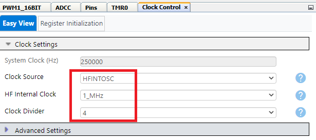

###### Configuration Bits
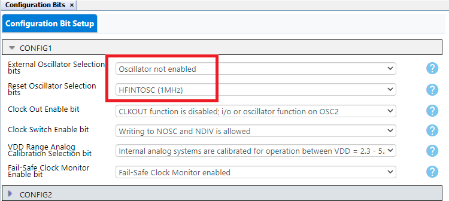

###### ADCC
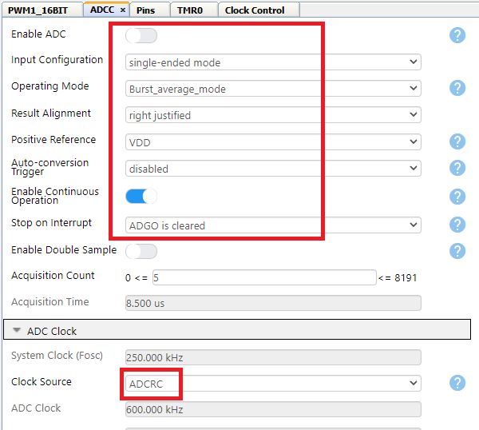
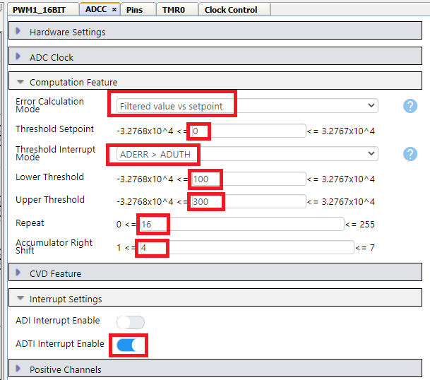

*Note: Channel Grouping is initialized in main.c as support is not yet available in MCC.*

###### PWM1
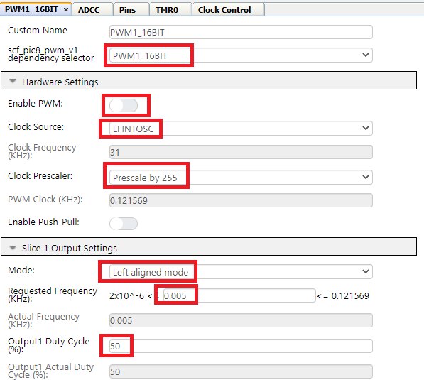

###### TMR0
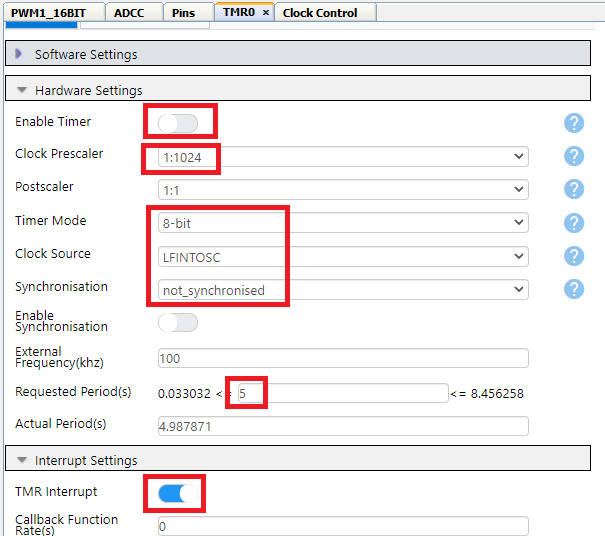

###### Pins
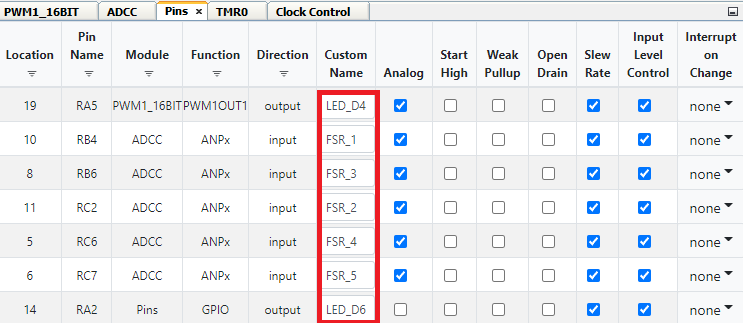

###### Pin Grid View
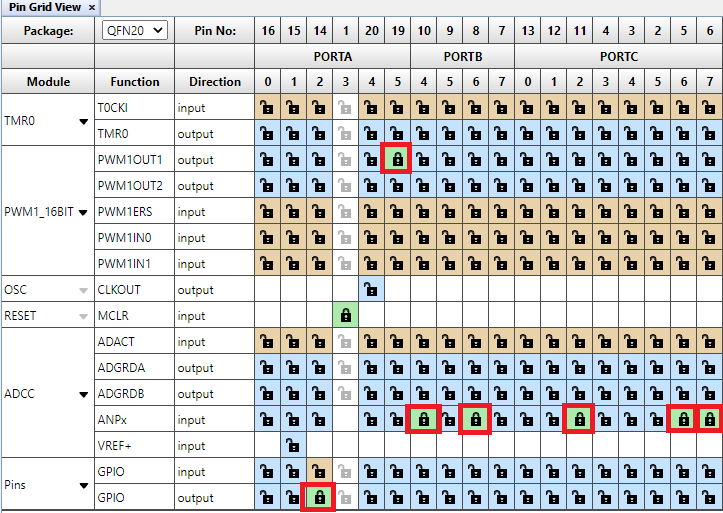

## Summary
The example demonstrated usage of ADCC channel grouping feature of PIC16F18146 & PIC16F17146 family of devices in a sensor array application such as smart door mat.
